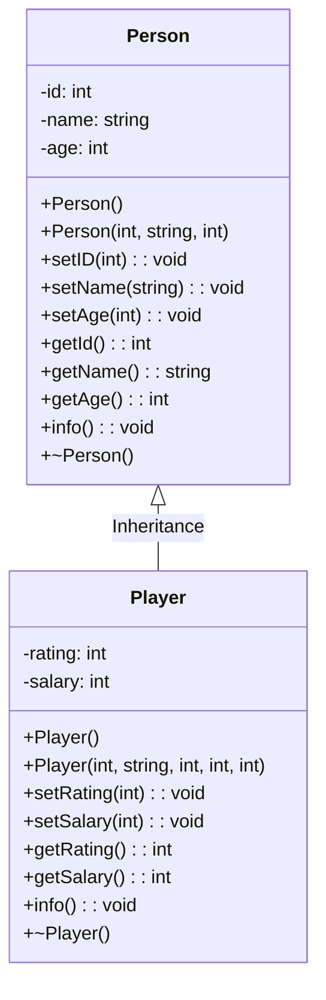

# Person and Player Class Implementation in C++


A comprehensive implementation demonstrating core OOP principles with validation and inheritance.

## Table of Contents
- [Overview](#overview)
- [Key Features](#key-features)
- [Class Architecture](#class-architecture)
  - [Person Class](#person-class)
  - [Player Class](#player-class)
- [Validation Rules](#validation-rules)
- [Execution Flow](#execution-flow)
- [How to Use](#how-to-use)
- [Sample Output](#sample-output)
- [Compilation](#compilation)
- [Improvement Opportunities](#improvement-opportunities)
- [Technical Specifications](#technical-specifications)

## Overview
This system implements two interconnected classes:
- **`Person`**: Base class managing fundamental identity attributes
- **`Player`**: Derived class extending `Person` with sports-specific properties



This C++ program demonstrates object-oriented programming concepts, including:
- **Encapsulation** (using private member variables and public methods)
- **Constructors and Destructors**
- **Inheritance** (Player class inherits from Person class)
- **Data Validation** (ensuring valid input values)
- **Class Methods** (getters, setters, and info display)

The program defines two classes:
- `Person`: Represents a general person with attributes like ID, Name, and Age.
- `Player`: Inherits from `Person` and adds attributes for Rating and Salary.

## Features
- Default and Parameterized Constructors
- Getters and Setters for attributes with validation
- A method (`info()`) to display object details
- Destructors that print a message when an object is deleted

## Program Structure
### 1. **Person Class**
- **Attributes**: `id`, `name`, `age`
- **Methods**:
  - `Person()`: Default constructor
  - `Person(int i, string n, int a)`: Parameterized constructor with validation
  - `setID(int i)`, `setName(string n)`, `setAge(int a)`: Setter methods with validation
  - `getId()`, `getName()`, `getAge()`: Getter methods
  - `info()`: Displays the person's information
  - `~Person()`: Destructor prints a goodbye message

### 2. **Player Class (inherits from Person)**
- **Additional Attributes**: `rating`, `salary`
- **Methods**:
  - `Player()`: Default constructor
  - `Player(int i, string n, int a, int r, int s)`: Parameterized constructor
  - `setRating(int r)`, `setSalary(int s)`: Setter methods with validation
  - `getRating()`, `getSalary()`: Getter methods
  - `info()`: Displays player details (calls `Person::info()` first)
  - `~Player()`: Destructor prints a goodbye message

## Program Execution
### **Main Function (`main()`)**
1. **Creates a `Person` object (Doctor) and displays its details.**
2. **Creates a `Player` object (Ronaldo) and displays its details.**
3. **Upon exiting, destructors are called automatically, printing goodbye messages.**

## Example Output
```plaintext
ID = 1 , Name is: "Mahmoud" , and age is 29 years old.
ID = 5 , Name is: "Ronaldo" , and age is 42 years old.
No: 7 , Salary: $500000
Goodbye, "Mahmoud".
Player destructor called for "Ronaldo"
Goodbye, "Ronaldo".
```

## Compilation and Execution
To compile and run the program, use the following commands:
```sh
g++ -o program main.cpp
./program
```

## Notes
- If an invalid ID (≤0) is entered, it defaults to `1`.
- If an invalid name (empty) is entered, it defaults to `"Unknown"`.
- If an age below `18` is entered, it defaults to `18`.
- If a negative rating or salary is entered, it defaults to `0` and `500000`, respectively.

## Author
This program is written for educational purposes to demonstrate object-oriented programming in C++.

